## 参考文献

[从电路设的计角度入门 Verilog HDL](https://www.bilibili.com/video/BV1PS4y1s7XW)

## 变量

### wire型
- 表示模块中的`连线`
- 仿真波形中`不可见`
- 默认位宽为`1bit`，使用时需要自定义位宽
### reg型
- 占用仿真环境的`物理内存`
- 仿真波形中`可见`
- 默认位宽为`1bit`，使用时需要自定义位宽
### 凡是...凡是...
- 凡是`always initial`语句中赋值的变量，一定是`reg型`
- 凡是`assign`语句中赋值的变量，一定是`wire型`
### 注意
- reg变量`仅仅是语法定义`，`不等于`电路中的`寄存器`
- 只有`时序逻辑电路`中的reg变量才会被逻辑综合工具`定义为``寄存器`

## 关键词
### 四个关键词
- `assign`
- `always`
- `if-else`
- `case`
- 使用verilog描述电路，仅需要上述四个关键词，如果描述不出来很可能是个人问题
- 其他关键词都是为描述`testbench`服务
### 禁止出现的关键词
- `for`
- `while`
- `function`
- `fork-join`
### assign 关键字
- 作用：对信号的*`连接`*，重命名，*`简单组合逻辑`*
- 赋值的对象应该是`wire类型`
- `=`右边的任何变化都会被立即计算驱动给等号左边
- 例子：
```verilog
    assign a = b | c;
    assign a = b ? c : d;
    assign a = d; 
```

### always块
- 后接`敏感列表`，用`@`表示
- `always@(a or b or c)`表示只要`a`，`b`，`c`中有一个产生变换，则执行该always块
- 一般包含`begin...end`语句组
- `always@(*)`表示自动将该always块中`所有引用的信号`都`自动添加`到敏感列表中
    - 防止漏掉敏感信号
    - `组合逻辑电路`
- `always@(posedge clk or negedge rst_n)`代表只在`clk上升沿`或`rst_n下降沿`执行该always块（**寄存器，描述时序逻辑**）
```verilog
    always@(posedge clk or posedge rst) begin
        ...
    end

    always@(posedge clk) begin
        ...
    end

    always@(negedge rst) begin
        ...
    end
```

### 2.1 电路结构描述方法
### 2.1.1 几种电路结构

- MUX
- 触发器与锁存器
- 组合逻辑
- 时序逻辑
- 存储器

#### 2.1.2 MUX

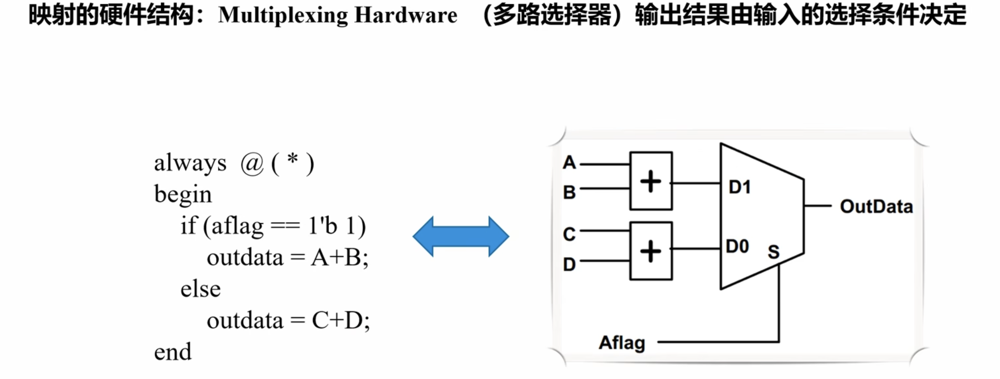

- 先加法，后选择

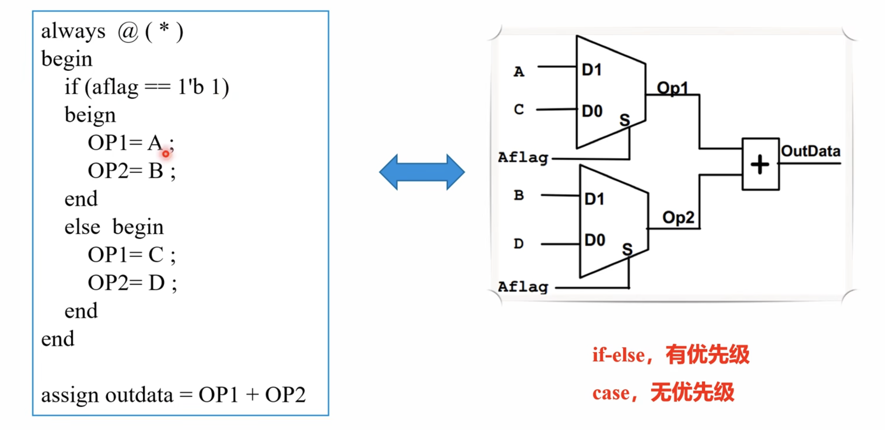

- 先选择，后加法
- 二者在性能和面积上有差别
- `if-else`，有优先级；`case`，没有优先级

#### 2.1.3 触发器与锁存器

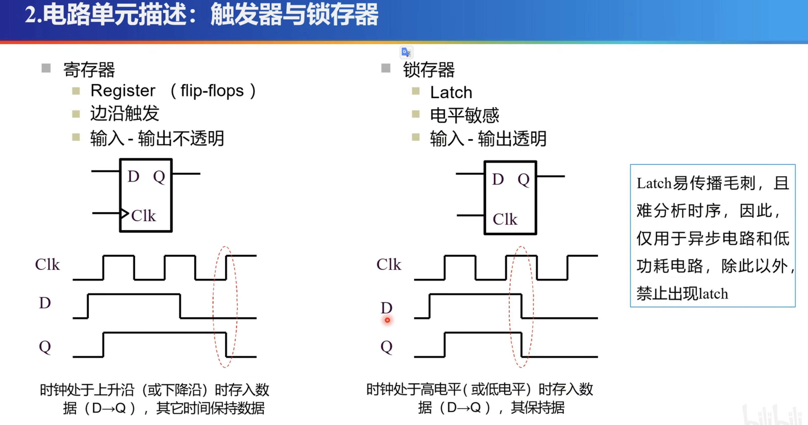


- 触发器

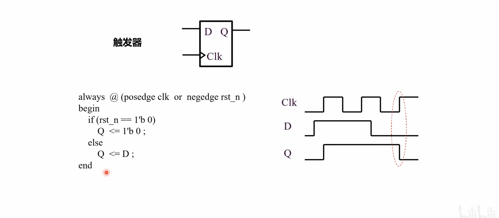

> 异步复位触发器，复位信号为0时，复位；时钟上升沿，输出

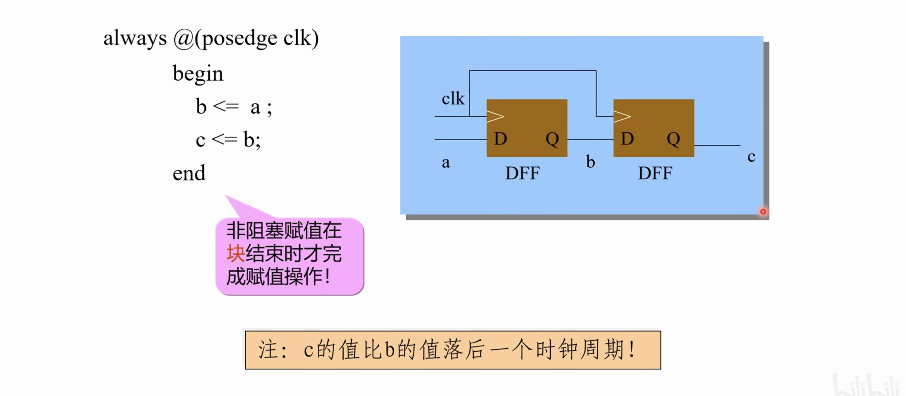

> 触发器的Q值要比D晚一个时钟周期/触发器延时；
>
> 设计电路时，需要关注时序，上图中b比a晚一个时钟周期，c比b晚一个时钟周期；
>
> 写verilog的时候就要想清楚`时序`，时序是个人设计好的，而不是仿真工具产生的；
>
> 想要延时一个时钟周期，就用一个触发器实现；
>
> 想要延时两个时钟周期，就要用两个触发器实现（上图）

#### 2.1.4 组合逻辑（电路）

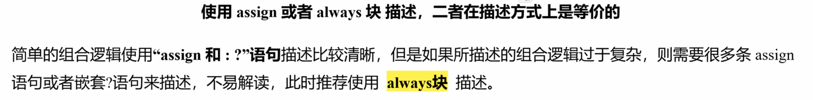

- 使用`always块`和`assign`实现相同组合逻辑：

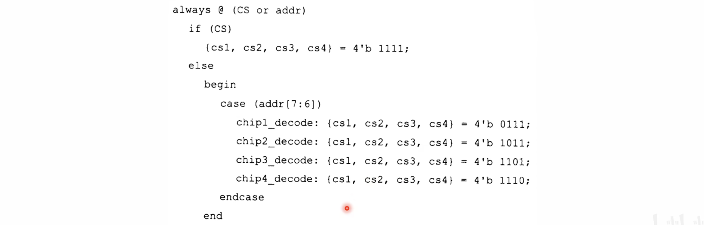

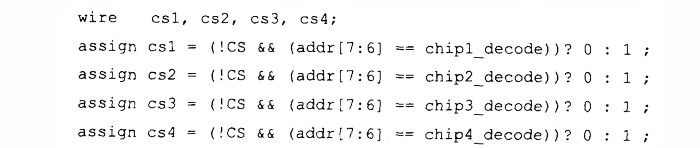

**组合逻辑**的赋值方式，**必须使用`=`**，即**阻塞赋值**；

组合逻辑`无保存或者锁存功能`，因此，没有复位信号与相关的复位逻辑

#### 2.1.5 时序逻辑（电路）

DFF 是 D- Flip-Flop，即D触发器

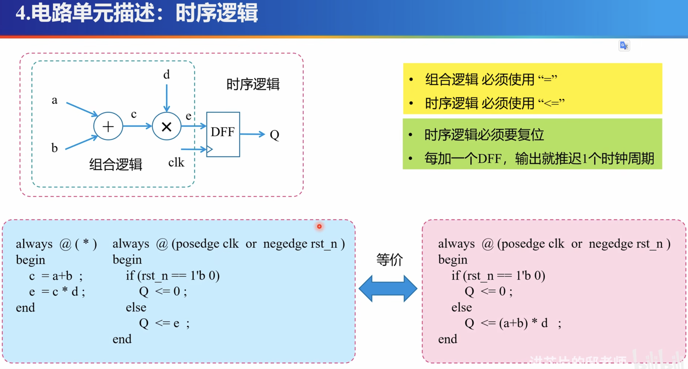

#### 2.1.6 存储器

类似于二维数组

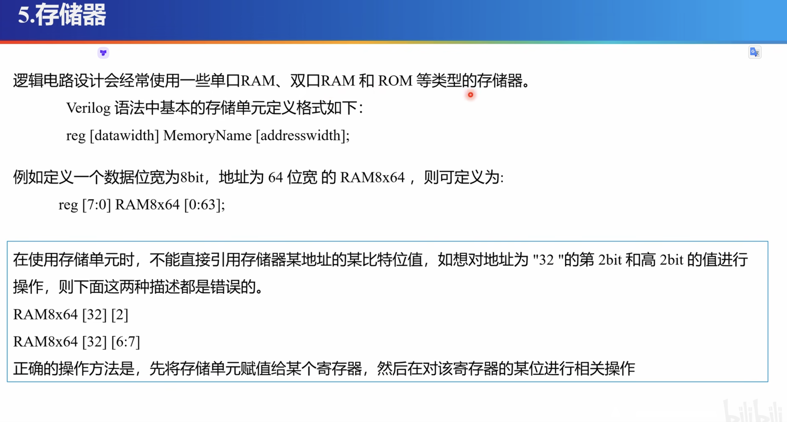

- 定义格式：`reg [datawidth] Memory_Name [addresswidth]`
    - reg型
    - `datawidth`：数据位宽
    - Memory_Name：存储器名称
    - `addresswidth`：地址位宽
- 实例：
    - `reg [7:0] RAM8x64 [0:63];`
    - 定义了一个名称为`RAM8x64`的存储器RAM
    - 数据位宽：8bit，一次读取8bit数据
    - 地址位宽：64bit，共$2^{64}$个地址
- 一次读取一个`datawidth`大小的数据，共`2^{addresswidth}`个地址
- 【正确的使用方法】先将从存储器中读取到的数据赋值给某个寄存器，然后对该寄存器的某位进行操作
- 【不推荐】不推荐使用verilog直接建模RAM；应当调用IP核

## 3. 流水线与参数化设计

### 3.1 流水线

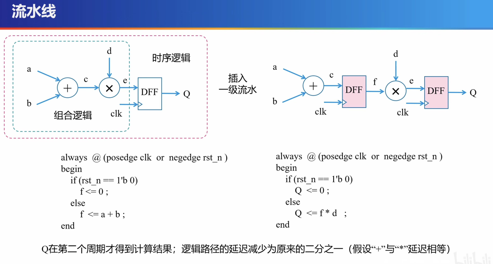

- 插入一级流水线后：
- 第一次Q产生结果需要两个时钟周期（前者，始终为两个时钟周期Q产生一次结果）
- 第二次及后续的每一个周期，Q都会产生一个结果

### 3.2 参数化

#### 3.2.1 参数化定义`延时`：

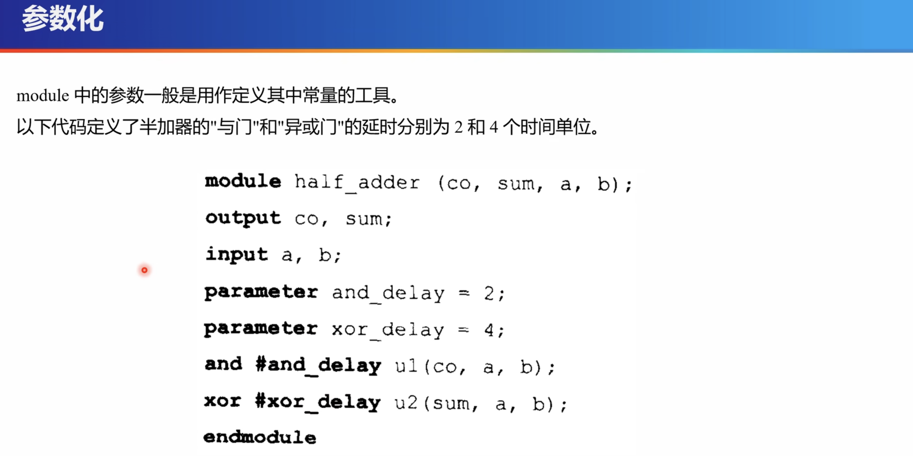

#### 3.2.2 参数化定义`位宽`：

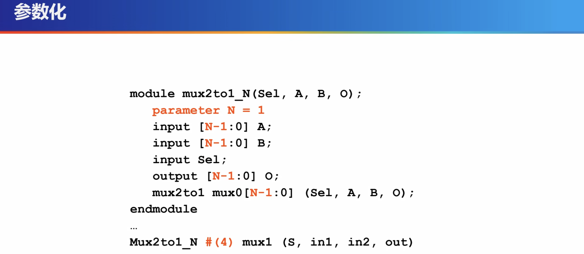

#### 3.2.3 使用`define`定义参数

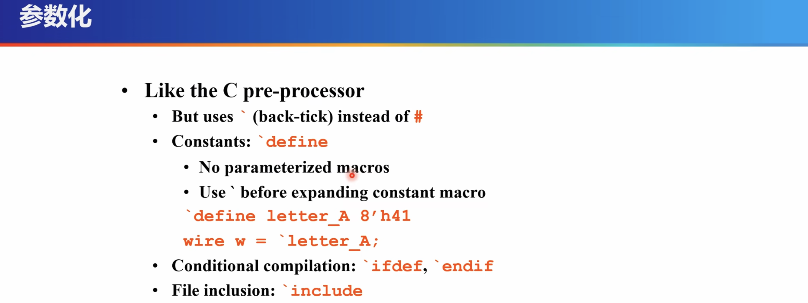

- 常用于处理器设计中的译码阶段中，定义指令的`微码`

#### 3.2.4 `define`和`parameter`的比较：

- `define`：是全局的定义
- `parameter`：是局部的定义

### 3.3 模块实例化

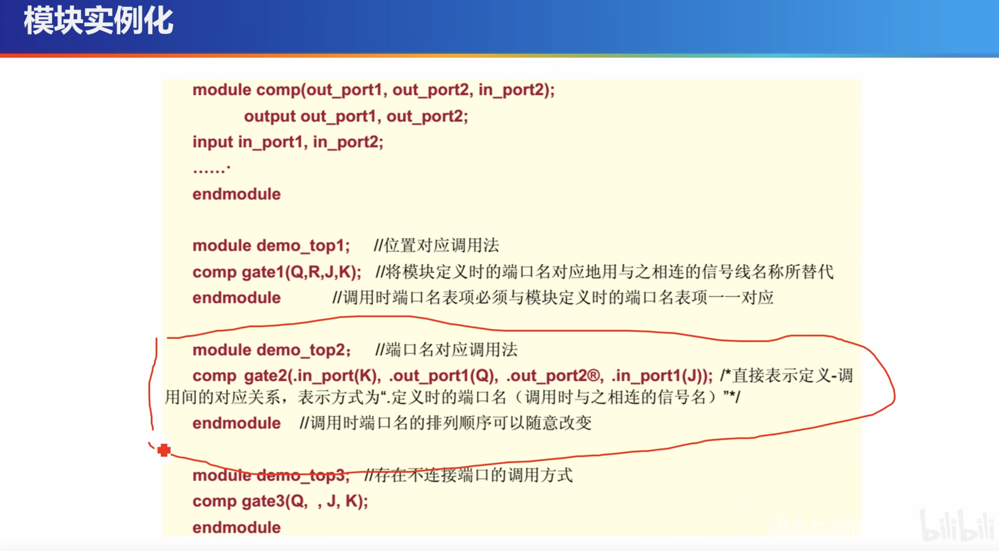

- 【推荐】端口名对应调用法


## 4. 基于开源EDA的仿真

### 4.1 参考文献

[一文学会使用全球第四大数字芯片仿真器iverilog - 知乎 (zhihu.com)](https://zhuanlan.zhihu.com/p/148795858)

### 4.2 工具：iverilog和gtkwave

仿真工具：`iverilog`

- 将verilog文件，编译成目标文件

波形查看工具：`gtkwave`

- 查看verilog `VCD`格式的波形文件

### 4.3 iverilog + gtkwave实例

#### 4.3.1 RTL代码：

```verilog
// adder_rtl.v
module adder(clk, rst_n, a, b, c);
	input [3:0] a;
	input [3:0] b;
	output [7:0] c;
	input clk, rst_n;

	wire [3:0] a;
	wire [3:0] b;
	wire [7:0] c;

	always @(posedge clk or negedge rst_m) begin
		if (rst_n == 1'b0)
			c <= 8'b0;
		else
			c <= a+b;
	end
endmodule
```

testbench代码：

```verilog
// adder_tb.v
`timescale 1ns/1ns
module adder_tb();
	reg [3:0] a;
	reg [3:0] b;
	wire [7:0] c;

	reg clk,rst_n;

	adder DUT (
		.clk(clk),
		.rst_n(rst_n),
		.a(a),
		.b(b),
		.c(c)
	);

	always begin
		#10 clk = 0;
		#10 clk = 1;
	end

	initial begin
		rst_n = 1;
		test(4'b1111, 4'b1111, 5'b11110);
		$finish;
	end
	task test;
		input [3:0] in;
		input [3:0] in2;
		input [7:0] e;
		begin
			a = in;
			b = in2;
			@(posedge clk);
			@(negedge clk);
			if (c == e) begin
				$display("It works");
			end else begin
				$display("opps %d + %d ~= %d, expect %d", in, in2, c, e);
			end
		end
	endtask
    initial begin
        $dumpfile("wave.vcd"); // 指定用作dumpfile的文件
        $dumpvars; // dump all vars
	end
endmodule
```

#### 4.3.2 在testbench中添加dump，才能生成波形文件：

```verilog
initial begin
    $dumpfile("wave.vcd"); // 指定用作dumpfile的文件
    $dumpvars; // dump all vars
end
```

- `$dumpfile()`：`dumpfile函数`生成波形
- `$dumpvars()`：规定仿真中某些特定模块和信号的数据

##### 1. vcd

```verilog
initial
begin
    $dumpfile("*.vcd");	  // *代表生成波形的文件名
    $dumpvars(0,**);  // **代表测试文件名
end
```

##### 2. fsdb（推荐）

fsdb文件是verdi使用一种专用的数据格式，类似于VCD；数据量小，能够提高仿真速度；

各家的仿真工具vcs、ncsim、modlesim等可以通过加载Verdi的PLI（一般位于安装目录下的`share/pli`目录下）直接`dump` `fsdb`文件。

在testbench中加入如下几行代码：

```verilog
initial
    begin
        $fsdbDumpfile("*.fsdb"); // *代表生成的fsdb的文件名
        $fsdbDumpvars(0,**);     // **代表测试文件名
    end
```

#### 4.3.3 使用iverilog进行编译：

```shell
iverilog adder_rtl.v adder_tb.v -o adder_test
```

- `-o`：指定输出文件的名称

#### 4.3.4 使用gtkwave查看vcd文件，观察波形：

```shell
gtkwave wave.vcd
```

----

